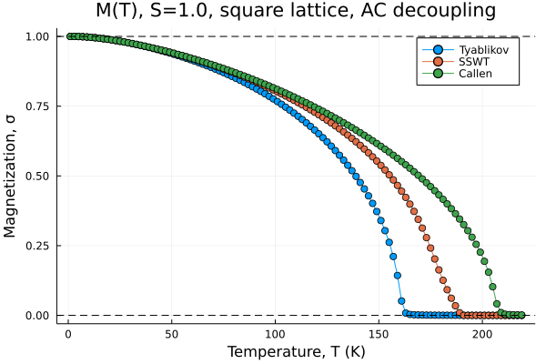

# Magnetization of 2D magnets
This Julia code calculated temperature-dependent magnetization of a 2D easy-axis ferromagnet using three different methods. The following quantum spin Hamiltonian is considered:
```math
H = \sum_{ij}J_{ij}S_iS_j - D\sum_iS^2_{iz},
```
where $S_i$ is the spin operator at site j, $J_{ij}$ is the exchange interaction between sites $i$ and $j$, and $D$ is the single-ion anisotropy parameter (SIA). One of the approaches to solve this Hamiltonian is to use the Green's function techniques. This method is based on approximations to decouple the intersite and on-site spin operators, i.e., $S_i^z(t)S^{\pm}_j(t)$ and $S_i^z(t)S^{\pm}_i(t)$. The most commonly used approximations to decouple the intersite spins are the Tyablikov approximation and the Callen approximation. Another approach is the self-consistent spin-wave theory (SSWT), based on the representation of spin operators in terms of bosonic and fermionic operators (the so-called BKJ representation), which is then solved in the mean-field approximation. In these three approximations, the exchange contribution to the magnon spectrum in case of a single spin sublattice reads,
```math
\omega_0({\bf q}) = (\sigma + \nu) [J({\bf q}) - J({\bf 0})],
```
where  $\sigma = \langle S_z \rangle$ is the averaged magnetization, and $\nu$ depends on the approximation:
```math
\nu = 0 \text{ [Tyablikov a.k.a. RPA]}
```
```math
\nu = \left(\frac{\sigma}{S}\right)^2\sum_{\bf q}\gamma_{\bf q}n_{\bf q}(T) \text{ [Callen]}
```
```math
\nu =  \sum_{\bf q}\gamma_{\bf q}n_{\bf q}(T) \text{ [SSWT]},
```
  with $\gamma_{\bf q}=(1/z_i)e^{i{\bf q}\cdot{\bf R}_i}$ being the form-factor weighted by the number of the corresponding neighbors $z_i$. 
For example, for a square lattice with nearest-neighbors, ${\gamma}_q= (1/2)[\mathrm{cos}(q_xa) + \mathrm{cos}(q_y a)]$. In the SSWT method, the average magnetization is simply given by $\sigma = S - \phi$, where $\phi=\sum _{\bf q} n _{\bf q}(T)$, representing the fact that magnetization is reduced by the magnon excitations. In the Green's function method, the expression for magnetization is dependent on $S$. For example,
```math
\sigma = \frac{1}{2}(1+2\phi)^{-1} \text{ [for $S$=1/2]},
```
```math
\sigma = \frac{1+2\phi}{1+3\phi + 3\phi^2} \text{ [for $S$=1]},
```
$etc$.
Since $\phi$ depends implicitly on $\sigma$ via the Bose factor $n_{\bf q}(T)$, the equations above are to be solved self-consistently.
The treaement of the anisotropy term in the Hamiltonian above is slightly more involved. The corresponding approximation should satisfy the kinematic condition, e.g., to result in vanishing contribution to the magnon spectrum for $S=1/2$. At low temperatures the contribution to the magnon spectrum can be deduced from the $1/S$ expansion of the boson operators in the Holstein-Primakoff (HP) representation. In the Green's function methods, it is common to use the so-called Anderson-Callen decoupling for the on-site spins. These approximations can be summarized as follows, 
```math
\omega_1({\bf q})=(2S-1)D  \text{ [HP, 0-th order]},
```
```math
\omega_1({\bf q})=(2S-1)D[1-2\phi/S] \text{ [HP, 2-th order]},
```
```math
\omega_1({\bf q})=(2S-1)D(\sigma/S)^2 \text{ [SSWT]},
```
```math
\omega_1({\bf q})=2D\sigma \left( 1 - \frac{1}{2S^2}\left[ S(S+1) - \langle S_z^2 \rangle \right]  \right)  \text{ [Anderson-Callen]}.
```
At $T=0$, all methods result in $\omega_1({\bf q})=(2S-1)D$. The Anderson-Callen decoupling depends on the average $\langle S_z^2 \rangle$ , whose explicit form again depends on $S$, and can be obtained iteratively from the system of known equations. For $S=1/2$ and $S=1$, these expressions take the form
```math
\langle S_z^2 \rangle = \frac{1}{4} \text{ [for $S$=1/2]},
```
```math
\langle S_z^2 \rangle = 2 - \sigma(1 + 2\phi) \text{ [for $S$=1]}.
```
## Example
The example below shows the $T$ dependent magnetization calculated for a square lattice with $S=1$, $J=10 meV$, and $D=0.1J$ using the methods outlined above. 

